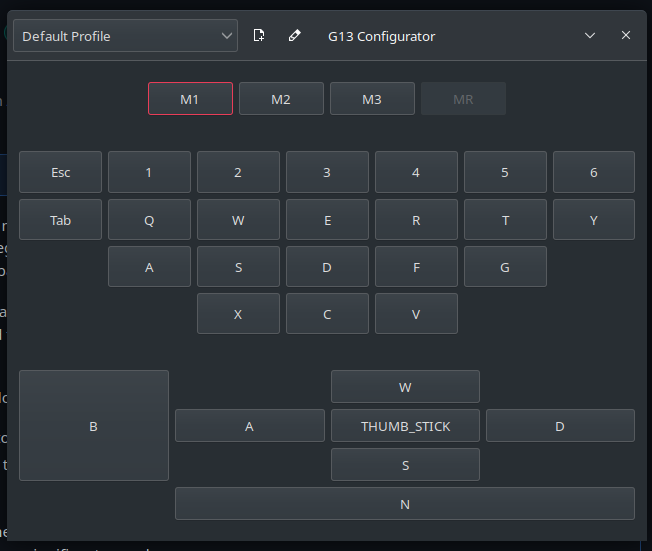

The G13 Configurator
====================



## What is this?

This is a stand-alone companion application and user space driver for
configuring a Logitech G13 game board. The original code was based upon another
driver originally written by ecraven, and available at
https://github.com/ecraven/g13, but this codebase was modernized, cleaned up
and totally rewritten in Python.

Using this tool allows you to:

  - Graphically plan out a keymapping profile
  - Save multiple profiles and switch between them at will
  - Use the LCD with pluggable dbus-based applets to display
    useful information
  - Switch profiles using the LCD

All wrapped up in a glorious Gtk 3.0 + libappindicator interface.

Please note: this is an early version of the application and as such it is still
in heavy development, but the author uses it almost on a daily basis already to
play most of her game library.

## Building

[](https://drone.hedron.io/jtgans/g13gui)

We have a continuous build running to make packaging, and periodically those
artifacts are brought over as releases on the Github site. The CI is run on
June's personal infrastructure via a gitea mirror, so releases may lag behind
a slight bit. June promises to redouble her efforts. :D

In general, though, g13gui is a python program, so no actual compilation takes
place. All the Makefile and associated infrastructure do is assemble distro
specific packages. If you want to skip the packaging (not recommended), it's
entirely possible to run the program out of the source tree by doing the
following:

```
[user@host g13gui]$ export PYTHONPATH=$PWD
[user@host g13gui]$ bin/g13gui &
[user@host g13gui]$ bin/g13-clock &
[user@host g13gui]$ bin/g13-profiles &
```

Note that you will have to manually install the udev rules file in `etc/` to
your appropriate distro-specific location.

### Building a package

In the major distributions, it should just be possible to run `make` to build
a package for your specific distro. As of this writing, there is support to
build for Debian, Ubuntu, Arch, Manjaro, and an experimental package for
Fedora. Patches are welcome to help improve availability on other platforms.

For the most up-to-date build instructions, have a look at the
[.drone.yml](.drone.yml) file, but below are more human-friendly instructions
for the five supported package systems.

#### Debian and Debian derivatives

First, setup your system with build tooling:

```
lupin:~$ sudo apt-get install devscripts python3 build-essential git-buildpackage appstream dh-sequence-python3 meson
```

Now you can build the package:

```
lupin:~/src/g13gui$ make
```

After this completes, you'll have a shiny new `deb` package inside of `build/` that you can
install using `make install`.

#### Arch and Arch derivatives

First, setup your system with build tooling:

```
lupin:~/src/g13gui$ sudo pacman -Syu
lupin:~/src/g13gui$ sudo pacman -S base-devel python meson lsb-release git
```

And build the package:

```
lupin:~/src/g13gui$ make
```

After this completes, you should have a shiny new `zst` package in `build/` that you can
install using `make install`.

#### Fedora and RPM derivatives

Fedora and its derivatives have a wild and wacky build system for making RPM packages
from `.spec` files. Thus, the `Makefile` kinda has to manage the build differently than
other builds, and modifies things outside of the source tree, sadly.

First, you need to setup your system with the build tooling:

```
[user@lupin g13gui]$ sudo dnf install rpmdevtools rpmlint make python meson lsb-release git
```

Now, here's where things get wacky. The `Makefile` uses `rpmbuild`'s `rpmdev-setuptree`
to create the `$HOME/rpmbuild` directory. Unfortunately, this is _entirely_ out of
our control, and the `rpmbuild` tooling insists (rather stupidly) that it work out
of this tree. So bear in mind, **if you already have an `rpmbuild` directory tree
prepped, the Makefile will clobber it.**

You can build the RPM in the usual way above, with:

```
[user@lupin g13gui]$ make
```

This will produce an RPM package you can install in the `build/` subdirectory
of the source tree. Unfortunately, the `rpmbuild` directory will still hang
around until you issue a `make clean`. You can install it using `make install`.

If you know of a better way of building RPMs, please send a pull request. June
hasn't used Fedora or RPM-based distros since she was in high school, so the
tooling is entirely foreign to her.

